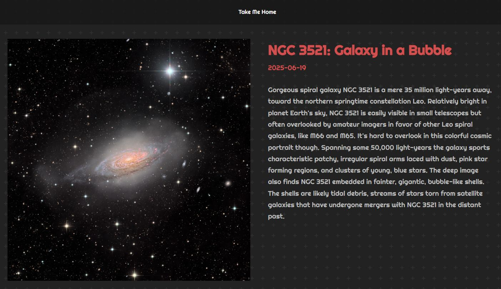
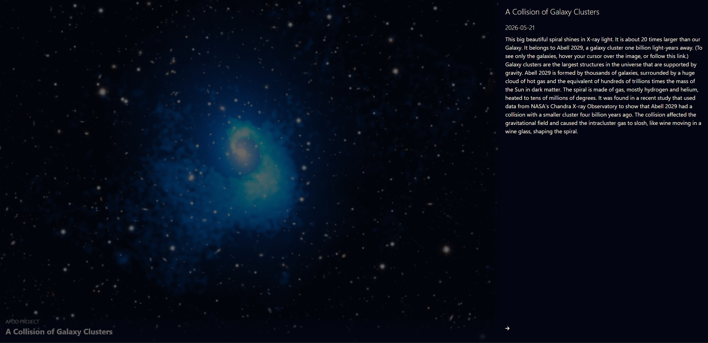

# React NASA API Apps

A collection of React apps using NASA APIs.

| App | Description | Demo |
|---|---|---|
| [APOD (Create React App)](./apod) | Astronomy Picture of the Day | [Live](https://joeaoregan.github.io/react-apod-api-app) |
| [APOD (Vite)](./apod-vite) | Astronomy Picture of the Day |  |
| [TechTransfer (Vite)](./techtransfer) | NASA TechTransfer API with Tailwind CSS |  |

---

# Screenshots

|  |
|:--:|
| *APOD App — Example Astronomy Picture of the Day from 19/06/2025* |

---

# Apps

## 1. APOD App — Create React App

```md
apod/
```

React app fetching NASA's Astronomy Picture of the Day using Create React App.

- Based on [this tutorial by Kapehe on YouTube](https://www.youtube.com/watch?v=H1nENYv-r_w)
- Deployed on GitHub Pages

**Run locally:**
```bash
cd apod
npm install
npm start
```

---

## 2. APOD App — Vite




```md
apod-vite/
```

React + Vite version of the NASA APOD app.

- Vite build tool
- Font Awesome icon set
- Responsive design
- API data fetching and caching
- Based on [Build a Space Website w. React.JS & the NASA API](https://www.youtube.com/watch?v=5Gf6grFgoG8)
- Deployed on GitHub Pages

**Run locally:**
```bash
cd apod-vite
npm install
npm run dev
```

---

## 3. TechTransfer App — Vite + Tailwind CSS

```md
techtransfer/
```

React + Vite app using the NASA TechTransfer API, styled with Tailwind CSS.

- Based on [React, Nasa REST API con Vitejs + Tailwindcss + gh-pages](https://www.youtube.com/watch?v=C-srYIh1Gvk)
- Deployed on GitHub Pages

**Run locally:**
```bash
cd techtransfer
npm install
npm run dev
```

---

# References

[NASA APIs](https://api.nasa.gov/)  
[Deploying a React App to GitHub Pages](https://github.com/gitname/react-gh-pages)  
[Deploy Vite React App to GitHub Pages](https://www.youtube.com/watch?v=Bk28snjHr7c)  
[Font Awesome](https://fontawesome.com/)  
[Tailwind CSS](https://tailwindcss.com/)  
[Build a Space Website w. React.JS & the NASA API](https://www.youtube.com/watch?v=5Gf6grFgoG8)  
[React, Nasa REST API con Vitejs + Tailwindcss + gh-pages](https://www.youtube.com/watch?v=C-srYIh1Gvk) (Spanish)  
[How To Deploy A React Vite App To Github Pages (Simple)](https://www.youtube.com/watch?v=hn1IkJk24ow)